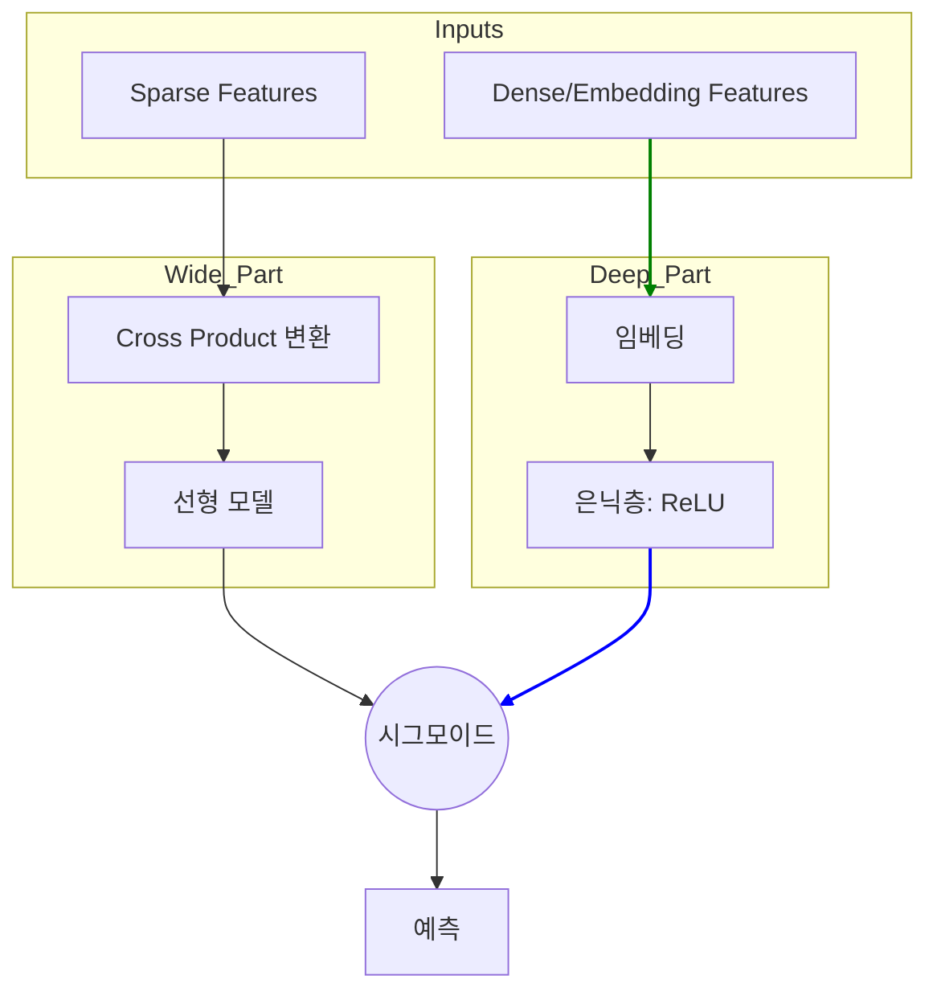

[< 상위 폴더로 이동](README.md)

<strong>전체 탐색 (RecSys 가이드)</strong>

- [홈](../../README.md)
- [01. 전통적 모델](../../01_Traditional_Models/README.md)
    - [협업 필터링](../../01_Traditional_Models/01_Collaborative_Filtering/README.md)
        - [메모리 기반](../../01_Traditional_Models/01_Collaborative_Filtering/01_Memory_Based/README.md)
        - [모델 기반](../../01_Traditional_Models/01_Collaborative_Filtering/02_Model_Based/README.md)
    - [콘텐츠 기반 필터링](../../01_Traditional_Models/02_Content_Based_Filtering/README.md)
- [02. 과도기 및 통계적 모델](../../02_Machine_Learning_Era/README.md)
- [03. 딥러닝 기반 모델](../../03_Deep_Learning_Era/README.md)
    - [MLP 기반](../../03_Deep_Learning_Era/01_MLP_Based/README.md)
    - [순차/세션 기반](../../03_Deep_Learning_Era/02_Sequence_Session_Based/README.md)
    - [그래프 기반](../../03_Deep_Learning_Era/03_Graph_Based/README.md)
    - [오토인코더 기반](../../03_Deep_Learning_Era/04_AutoEncoder_Based/README.md)
- [04. 최신 및 생성형 모델](../../04_SOTA_GenAI/README.md)
    - [LLM 기반](../../04_SOTA_GenAI/01_LLM_Based/README.md)
    - [멀티모달 추천](../../04_SOTA_GenAI/02_Multimodal_RS.md)
    - [생성형 추천](../../04_SOTA_GenAI/03_Generative_RS.md)

# Wide & Deep Learning

## 1. 상세 설명 (Detailed Description)

### 정의 (Definition)

**Wide & Deep Learning**은 2016년 구글이 Google Play Store 추천 시스템을 위해 제안한 모델 아키텍처입니다. 이 모델은 두 가지 모델의 장점을 결합했습니다:

1.  **Wide 모델 (선형 모델)**: **암기(Memorization)**에 강합니다 (빈번하게 등장하는 동시 발생 패턴을 학습).
2.  **Deep 모델 (심층 신경망)**: **일반화(Generalization)**에 강합니다 (추상적인 표현을 학습하고 새로운 조합을 탐색).

### 해결하고자 하는 문제 (The Problem it Solves)

- **선형 모델**은 구체적인 규칙(예: "아이템 A를 산 사람은 아이템 B를 산다")에는 강하지만, 학습 데이터에 한 번도 나오지 않은 조합은 추천하지 못합니다 (일반화 부족).
- **Deep 모델**(임베딩 기반)은 직접적인 동시 발생이 없어도 유사한 아이템을 찾는 데 뛰어나지만, 때로는 지나치게 일반화(Over-generalize)하여 엉뚱한 추천을 할 수 있습니다 (예: 틈새 다큐멘터리를 좋아하는 사람에게 단지 벡터가 가깝다는 이유로 블록버스터를 추천).
- **Wide & Deep**은 이 트레이드오프의 균형을 맞춥니다.

### 주요 특징 (Key Characteristics)

- **공동 학습 (Joint Training)**: Wide 컴포넌트와 Deep 컴포넌트가 동시에 학습됩니다.
- **장점**:
  - 정밀도(암기)와 재현율(일반화)의 균형을 맞춥니다.
  - 실제 서비스(Production)에 적용하기 쉽고 확장성이 뛰어납니다.
- **단점**:
  - Wide 부분에 들어갈 "Cross-Product" 피처를 선정하는 데 피처 엔지니어링이 필요합니다.

---

## 2. 작동 원리 (Operating Principle)

### A. Wide 컴포넌트 (Memorization)

일반화 선형 모델(Generalized Linear Model)처럼 작동합니다.

- **입력**: 원시 희소 특징(Raw sparse features) 및 Cross-product 변환 특징.
- **Cross-Product**: 두 이진 특징 간의 상호작용을 포착합니다.
  - 예: `AND(User_Language=English, App_Language=English)` -> 1.
  - 모델은 "둘 다 영어면 다운로드할 확률이 높다"라는 규칙을 학습합니다.
- **수식**: $y = w^T x + b$.

### B. Deep 컴포넌트 (Generalization)

피드포워드 신경망(Feed-forward Neural Network)처럼 작동합니다.

- **입력**: 범주형 특징의 밀집 임베딩(Dense embeddings).
- **과정**: 임베딩 $\to$ 은닉층(Hidden Layers) $\to$ 출력.
- **이점**: 사용자가 "치킨"과 "버거"를 같이 산 적이 없더라도, 둘 다 "패스트푸드"와 가깝다는 것을 학습하여 연결해 줍니다.

### C. 공동 학습 (Joint Training)

$$ P(Y=1|x) = \sigma( \underbrace{w*{wide}^T [x, \phi(x)]}*{\text{Wide}} + \underbrace{w*{deep}^T a^{(lf)}}*{\text{Deep}} + b) $$

- 오차 역전파가 두 부분 모두에 동시에 일어납니다.

---

## 3. 흐름 예시 (Flow Example)

### 시나리오: 앱 추천

**사용자**: "포켓몬" 게임을 좋아함.
**후보 A**: "포켓몬 GO" (직접 관련).
**후보 B**: "디지몬 어드벤처" (유사 장르).

### 처리 과정

1.  **Wide 컴포넌트 (암기)**:

    - 규칙 발견: `User_Installed("Pokémon Red") AND App="Pokémon GO"`.
    - 통계적으로 이 규칙은 가중치가 매우 높음.
    - **후보 A에 강력한 신호**.

2.  **Deep 컴포넌트 (일반화)**:

    - 임베딩: "포켓몬" 벡터 $\approx$ "디지몬" 벡터 (둘 다 몬스터 RPG).
    - **후보 B에 강력한 신호** (후보 A에도 신호 있음).

3.  **최종 예측**:
    - **후보 A**: 높은 Wide 점수 + 높은 Deep 점수 = 매우 높은 확률.
    - **후보 B**: 낮은 Wide 점수 (직접 규칙 없음) + 높은 Deep 점수 = 중간 확률.
    - **결과**: "포켓몬 GO"를 최우선으로 추천(안전), 그 다음 "디지몬" 추천(발견).

### 시각적 다이어그램

