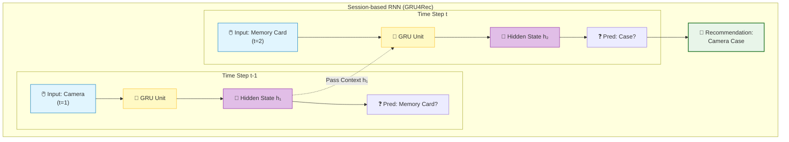

[< 상위 폴더로 이동](README.md)

<strong>전체 탐색 (RecSys 가이드)</strong>

- [홈](../../README.md)
- [01. 전통적 모델](../../01_Traditional_Models/README.md)
  - [협업 필터링](../../01_Traditional_Models/01_Collaborative_Filtering/README.md)
    - [메모리 기반](../../01_Traditional_Models/01_Collaborative_Filtering/01_Memory_Based/README.md)
    - [모델 기반](../../01_Traditional_Models/01_Collaborative_Filtering/02_Model_Based/README.md)
  - [콘텐츠 기반 필터링](../../01_Traditional_Models/02_Content_Based_Filtering/README.md)
- [02. 과도기 및 통계적 모델](../../02_Machine_Learning_Era/README.md)
- [03. 딥러닝 기반 모델](../../03_Deep_Learning_Era/README.md)
  - [MLP 기반](../../03_Deep_Learning_Era/01_MLP_Based/README.md)
  - [순차/세션 기반](../../03_Deep_Learning_Era/02_Sequence_Session_Based/README.md)
  - [그래프 기반](../../03_Deep_Learning_Era/03_Graph_Based/README.md)
  - [오토인코더 기반](../../03_Deep_Learning_Era/04_AutoEncoder_Based/README.md)
- [04. 최신 및 생성형 모델](../../04_SOTA_GenAI/README.md) - [LLM 기반](../../04_SOTA_GenAI/01_LLM_Based/README.md) - [멀티모달 추천](../../04_SOTA_GenAI/02_Multimodal_RS.md) - [생성형 추천](../../04_SOTA_GenAI/03_Generative_RS.md)

# GRU4Rec (RNN-based)

## 1. 상세 설명 (Detailed Description)

### 정의 (Definition)

**GRU4Rec**은 순환 신경망(RNN)의 일종인 GRU(Gated Recurrent Units)를 세션 기반 추천 문제에 적용한 기념비적인 모델입니다. 사용자 기록을 정적인 "아이템 주머니(Bag of items)"로 취급하던 전통적인 방식과 달리, GRU4Rec은 순서가 중요한 **동적 시퀀스(Dynamic Sequence)**로 취급합니다.

### 해결하고자 하는 문제 (The Problem it Solves)

- **세션 기반 맥락 (Session-based Context)**: 많은 시나리오(이커머스, 뉴스)에서 사용자는 익명입니다(User ID 없음). 현재 세션의 짧은 클릭 기록만 가지고 있습니다.
- **순차적 의존성 (Sequence Dependency)**: "전화기 -> 케이스"는 강한 패턴이지만, "케이스 -> 전화기"는 드뭅니다. 표준적인 행렬 분해는 이러한 방향성(순서)을 포착하지 못합니다.

### 주요 특징 (Key Characteristics)

- **세션 병렬 미니배치 (Session-Parallel Mini-batches)**: 다양한 세션 길이를 효율적으로 처리하기 위한 특수한 학습 기법입니다.
- **쌍별 손실 (Pairwise Loss, BPR)**: 정답인 다음 아이템의 점수를 오답 아이템보다 높게 매기도록 최적화합니다.
- **장점**:
  - 단기적인 관심사를 효과적으로 포착합니다.
  - 익명 세션(로그인 안 한 사용자)에 잘 작동합니다.
- **단점**:
  - 매우 긴 의존성은 포착하기 어렵습니다 (RNN의 기울기 소실 문제, GRU가 완화하긴 했지만 여전히 존재).
  - 순차적 처리 방식이라 트랜스포머의 병렬 처리보다 느립니다.

---

## 2. 작동 원리 (Operating Principle)

### 아키텍처

1.  **입력 레이어**:
    - 현재 클릭된 아이템 $i_t$가 원-핫 인코딩(또는 임베딩)되어 들어옵니다.
2.  **GRU 레이어 (Gated Recurrent Unit)**:
    - 현재까지의 세션 "기억" 역할을 하는 은닉 상태(Hidden State) $h_t$를 유지합니다.
    - $$ h*t = \text{GRU}(h*{t-1}, i_t) $$
    - GRU 게이트는 이전 기억을 얼마나 유지할지(Update Gate), 얼마나 잊을지(Reset Gate)를 제어합니다.
3.  **출력 레이어**:
    - $h_t$를 기반으로 _다음_ 아이템 $i_{t+1}$이 무엇일지 확률 분포를 예측합니다.
    - $$ \hat{y} = \text{Softmax}(W\_{out} h_t) $$

### 손실 함수

주로 **TOP1 Loss** 또는 **BPR (Bayesian Personalized Ranking) Loss**를 사용합니다.
$$ L = - \sum \log(\sigma(\hat{r}_{pos} - \hat{r}_{neg})) $$
정답 아이템(Positive)의 점수가 랜덤한 오답 아이템(Negative)의 점수보다 확실히 높을 때 최대화됩니다.

---

## 3. 흐름 예시 (Flow Example)

### 시나리오: 온라인 쇼핑

**세션**: 사용자가 [**카메라**, **메모리 카드**, **?**] 순서로 클릭함.

### 단계별 처리

1.  **1단계: "카메라" 입력** ($t=1$)

    - 카메라 임베딩이 GRU에 입력됨.
    - 은닉 상태 $h_1$ 업데이트: "맥락: 카메라에 관심 있음".
    - 예측: 렌즈, 삼각대, 메모리 카드 등.

2.  **2단계: "메모리 카드" 입력** ($t=2$)

    - 메모리 카드 임베딩과 이전 상태 $h_1$이 GRU에 입력됨.
    - 은닉 상태 $h_2$ 업데이트: "맥락: 카메라 + 메모리 카드 (촬영 준비 완료?)".
    - 예측: 모델은 사용자가 메인 기기와 저장 장치를 가졌음을 인지함. 다음 논리적 단계는 보호 장비나 전원.
    - **Top 예측**: **카메라 가방**.

3.  **결과**:
    - 만약 순서를 무시하는 MF를 썼다면, "카메라"와 "메모리 카드"는 단순히 비슷한 전자기기를 추천했을 것입니다. GRU4Rec은 "악세서리"로 이어지는 *흐름*을 이해합니다.
    -

### 시각적 다이어그램

