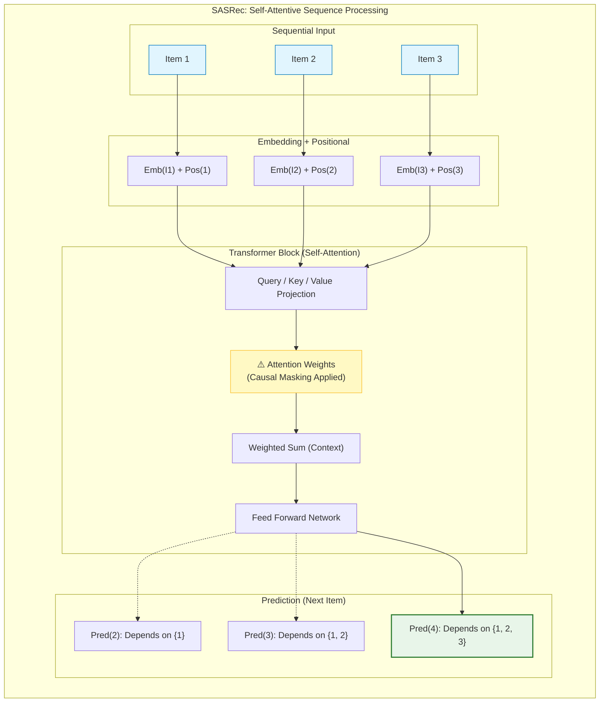

[< 상위 폴더로 이동](README.md)

<strong>전체 탐색 (RecSys 가이드)</strong>

- [홈](../../README.md)
- [01. 전통적 모델](../../01_Traditional_Models/README.md)
  - [협업 필터링](../../01_Traditional_Models/01_Collaborative_Filtering/README.md)
    - [메모리 기반](../../01_Traditional_Models/01_Collaborative_Filtering/01_Memory_Based/README.md)
    - [모델 기반](../../01_Traditional_Models/01_Collaborative_Filtering/02_Model_Based/README.md)
  - [콘텐츠 기반 필터링](../../01_Traditional_Models/02_Content_Based_Filtering/README.md)
- [02. 과도기 및 통계적 모델](../../02_Machine_Learning_Era/README.md)
- [03. 딥러닝 기반 모델](../../03_Deep_Learning_Era/README.md)
  - [MLP 기반](../../03_Deep_Learning_Era/01_MLP_Based/README.md)
  - [순차/세션 기반](../../03_Deep_Learning_Era/02_Sequence_Session_Based/README.md)
  - [그래프 기반](../../03_Deep_Learning_Era/03_Graph_Based/README.md)
  - [오토인코더 기반](../../03_Deep_Learning_Era/04_AutoEncoder_Based/README.md)
- [04. 최신 및 생성형 모델](../../04_SOTA_GenAI/README.md) - [LLM 기반](../../04_SOTA_GenAI/01_LLM_Based/README.md) - [멀티모달 추천](../../04_SOTA_GenAI/02_Multimodal_RS.md) - [생성형 추천](../../04_SOTA_GenAI/03_Generative_RS.md)

# SASRec / BERT4Rec (Transformer-based)

## 1. 상세 설명 (Detailed Description)

### 정의 (Definition)

NLP에서 유명한 **Transformer** 아키텍처("Attention Is All You Need")를 순차적 추천에 적용한 모델들입니다.

- **SASRec (Self-Attentive Sequential Recommendation)**: GPT처럼 단방향 트랜스포머를 사용하여, _과거_ 아이템을 기반으로 다음 아이템을 예측합니다.
- **BERT4Rec**: BERT처럼 양방향 트랜스포머를 사용하여, 과거와 미래 문맥을 모두 사용하여 _마스킹된_ 아이템을 예측(Cloze Task)하며 강건한 표현을 학습합니다.

### 해결하고자 하는 문제 (The Problem it Solves)

- **RNN의 한계**: RNN(GRU/LSTM)은 아이템을 순서대로($1 \to 2 \to 3$) 처리해야 하므로 병렬화가 불가능하고, 아주 오래된 아이템을 기억하는 데 어려움이 있습니다 ("기울기 소실").
- **어텐션 메커니즘**: 트랜스포머는 과거의 어느 시점에 있는 아이템이든 거리에 상관없이 직접 "주목(Attend)"할 수 있어, 장기 의존성을 완벽하게 포착합니다.

### 주요 특징 (Key Characteristics)

- **Self-Attention**: "현재 예측을 위해 과거의 어떤 아이템들이 중요한가?"
- **장점**:
  - 순차 추천 분야의 SOTA(State-of-the-Art) 성능.
  - (RNN과 달리) 병렬 학습이 가능하여 속도가 빠름.
- **단점**:
  - 긴 시퀀스에 대해 계산 복잡도가 높습니다 ($O(L^2)$ 또는 $O(L \log L)$).
  - 많은 데이터가 필요합니다(Data hungry).

---

## 2. 작동 원리 (Operating Principle)

### A. 셀프 어텐션 메커니즘 (Self-Attention Mechanism)

핵심 엔진입니다. 쿼리($Q$)와 키($K$)의 호환성을 기반으로 모든 값($V$)의 가중 합을 계산합니다.
$$ \text{Attention}(Q, K, V) = \text{softmax}(\frac{QK^T}{\sqrt{d_k}})V $$

- RecSys에서: "내가 지금 보고 있는 '게임 CD'(Query)와 5단계 전에 샀던 '게임기'(Key)가 얼마나 관련이 있나?" -> 관련 높음 -> 높은 어텐션 가중치.

### B. SASRec (Left-to-Right)

- **입력**: 시퀀스 $[i_1, i_2, ... i_t]$.
- **목표**: $i_{t+1}$ 예측.
- **마스킹**: 위치 $t$는 $1...t$까지만 볼 수 있도록(Causal Masking), 미래 정보를 보지 못하게 차단합니다.

### C. BERT4Rec (Cloze Task)

- **학습**: 시퀀스에서 아이템을 무작위로 마스킹합니다: $[i_1, \text{[MASK]}, i_3, i_4]$.
- **목표**: $i_1$(왼쪽 문맥)과 $i_3, i_4$(오른쪽 문맥)를 모두 사용하여 [MASK]가 무엇인지 맞춥니다.
- **추론**: 시퀀스 끝에 [MASK]를 붙여 다음 아이템을 예측합니다.

---

## 3. 흐름 예시 (Flow Example)

### 시나리오: 사용자 기록

시퀀스: [**폰**, **케이스**, **충전기**, **헤드폰**]

### SASRec 프로세스 (다음 예측)

1.  **임베딩**: 아이템을 벡터로 변환 + **위치 임베딩(Positional Embedding)** 추가 (순서 정보).
2.  **어텐션 레이어**:
    - 타겟: 위치 4 (헤드폰).
    - 위치 1 (폰)을 돌아봄: "매우 관련 높음".
    - 위치 2 (케이스)를 돌아봄: "덜 관련됨".
3.  **집계**: 모델은 폰(50%), 충전기(30%), 케이스(20%)가 섞인 맥락 벡터를 생성.
4.  **예측**: "폰" + "헤드폰" 맥락 $\to$ 다음 아이템은 **"음악 스트리밍 구독권"** 또는 **"거치대"**.

### BERT4Rec 프로세스 (학습 중)

1.  **입력**: [폰, [MASK], 충전기, 헤드폰].
2.  **어텐션**: [MASK]는 "폰"(과거)과 "충전기"(미래)를 동시에 참조.
3.  **추론**:
    - "폰"을 보니 케이스가 필요함.
    - "충전기"를 보니 전자기기임.
    - **예측**: 빈칸에 들어갈 말은 아마도 **"케이스"**.

### 시각적 다이어그램 (SASRec)

