[< 상위 폴더로 이동](README.md)

<strong>전체 탐색 (RecSys 가이드)</strong>

- [홈](../../README.md)
- [01. 전통적 모델](../../01_Traditional_Models/README.md)
  - [협업 필터링](../../01_Traditional_Models/01_Collaborative_Filtering/README.md)
    - [메모리 기반](../../01_Traditional_Models/01_Collaborative_Filtering/01_Memory_Based/README.md)
    - [모델 기반](../../01_Traditional_Models/01_Collaborative_Filtering/02_Model_Based/README.md)
  - [콘텐츠 기반 필터링](../../01_Traditional_Models/02_Content_Based_Filtering/README.md)
- [02. 과도기 및 통계적 모델](../../02_Machine_Learning_Era/README.md)
- [03. 딥러닝 기반 모델](../../03_Deep_Learning_Era/README.md)
  - [MLP 기반](../../03_Deep_Learning_Era/01_MLP_Based/README.md)
  - [순차/세션 기반](../../03_Deep_Learning_Era/02_Sequence_Session_Based/README.md)
  - [그래프 기반](../../03_Deep_Learning_Era/03_Graph_Based/README.md)
  - [오토인코더 기반](../../03_Deep_Learning_Era/04_AutoEncoder_Based/README.md)
- [04. 최신 및 생성형 모델](../../04_SOTA_GenAI/README.md) - [LLM 기반](../../04_SOTA_GenAI/01_LLM_Based/README.md) - [멀티모달 추천](../../04_SOTA_GenAI/02_Multimodal_RS.md) - [생성형 추천](../../04_SOTA_GenAI/03_Generative_RS.md)

# 신경망 그래프 협업 필터링 (Neural Graph Collaborative Filtering, NGCF)

## 1. 상세 설명 (Detailed Description)

### 정의 (Definition)

**NGCF** (SIGIR 2019)는 협업 필터링에 특화된 그래프 신경망(GNN) 프레임워크입니다. 사용자-아이템 통합 그래프(Integration Graph)의 고차원 연결성을 명시적으로 모델링하여, 이를 사용자와 아이템의 임베딩에 주입(Embed)합니다.

### 해결하고자 하는 문제 (The Problem it Solves)

- **전통적 MF**는 최종 예측 단계에서만 "상호작용"($u \cdot i$)을 고려합니다. 협업 신호(Collaborative Signal)가 임베딩 자체에 인코딩되지 않습니다.
- **NGCF**는 $e_u$ 임베딩 자체가 $u$가 좋아한 아이템들과, 그 아이템을 좋아한 다른 사용자들에 대한 정보를 내포해야 한다고 주장합니다.
- **연결성 (Connectivity)**: $User_1 \to Item_A \to User_2 \to Item_B$. 이 경로는 $User_1$이 $User_2$와 유사하므로 $Item_B$를 좋아할 수 있음을 시사합니다. NGCF는 이러한 $L$-hop 신호를 포착합니다.

### 주요 특징 (Key Characteristics)

- **임베딩 전파 (Embedding Propagation)**: 이웃의 정보를 재귀적으로 집계하여 임베딩을 정제(Refine)합니다.
- **장점**:
  - 그래프 구조를 활용하여 MF 대비 상당한 성능 향상을 이뤘습니다.
- **단점**:
  - 각 레이어마다 밀집 행렬(Dense Matrix) 연산과 비선형 활성화 함수가 있어 계산 비용이 높습니다.
  - 나중에 (LightGCN에 의해) 비선형성이 추천 성능에는 오히려 해롭다는 것이 밝혀졌습니다.

---

## 2. 작동 원리 (Operating Principle)

### A. 그래프 구조

이분 그래프(Bipartite Graph): 한쪽엔 사용자, 다른 쪽엔 아이템. 엣지는 상호작용(평점, 클릭)을 나타냅니다.

### B. 임베딩 전파 레이어 (Embedding Propagation Layer)

사용자 $u$와 이웃 아이템 $i$에 대해:

1.  **메시지 생성 (Message Construction)**:
    $$ m\_{u \leftarrow i} = \frac{1}{\sqrt{|N_u||N_i|}} (W_1 e_i + W_2 (e_i \odot e_u)) $$

    - 전통적인 GCN은 $W_1 e_i$만 사용합니다.
    - NGCF는 특징 간 상호작용을 강하게 포착하기 위해 $e_i \odot e_u$를 추가했습니다 (FM과 유사).

2.  **집계 (Aggregation)**:
    $$ e*u^{(l)} = \text{LeakyReLU}(m*{u \leftarrow u} + \sum*{i \in N_u} m*{u \leftarrow i}) $$

    - 자기 자신의 정보(Self-connection)와 이웃의 정보를 결합합니다.

3.  **고차원 전파 (High-order Propagation)**:
    $L$개의 레이어를 쌓아 $L$-hop 이웃까지 포착합니다.

### C. 예측 (Prediction)

모든 레이어의 임베딩을 결합(Concatenate)하여 최종 표현을 만듭니다:
$$ e_u^\* = [e_u^{(0)}, e_u^{(1)}, ..., e_u^{(L)}] $$
그 후 내적(Dot Product)을 수행합니다.

---

## 3. 흐름 예시 (Flow Example)

### 시나리오

**그래프**: User A --(연결)--> Item 1 --(연결)--> User B --(연결)--> Item 2.
**목표**: User A에게 추천하기.

### 전파 단계

1.  **레이어 1 (직접 이웃)**:

    - User A는 **Item 1**의 정보를 집계합니다.
    - User A의 벡터는 이제 Item 1에 대해 "알게" 됩니다.

2.  **레이어 2 (이웃의 이웃)**:

    - User A는 이웃들의 _새로운_ 벡터로부터 정보를 집계합니다.
    - Item 1의 벡터(레이어 1 결과)는 이미 **User B**의 정보를 담고 있습니다.
    - 따라서, User A는 간접적으로 **User B**의 정보를 흡수합니다.

3.  **레이어 3 (3-hop)**:
    - User B의 벡터(레이어 2 결과)는 **Item 2**의 정보를 담고 있습니다.
    - User A는 경로 $A \to 1 \to B \to 2$를 통해 효과적으로 **Item 2**를 "보게" 됩니다.
    - 모델은 Item 2가 User A와 관련이 있음을 학습합니다.

### 시각적 다이어그램

```mermaid
graph TD
    subgraph "NGCF: Message Passing & Propagation"
        direction TB

        %% High-Level Flow
        subgraph "Initial Embeddings (Layer 0)"
            U0["👤 User u (e_u^0)"]
            I0["🎬 Item i (e_i^0)"]
        end

        %% Layer 1 Propagation
        subgraph "Layer 1: Bi-Interaction Aggregation"
            direction TB
            Msg_I_to_U["📨 Message i→u<br>W1•e_i + W2•(e_i ⊙ e_u)"]
            Msg_U_to_I["📨 Message u→i<br>W1•e_u + W2•(e_u ⊙ e_i)"]

            U0 --> Msg_U_to_I
            I0 --> Msg_U_to_I

            I0 --> Msg_I_to_U
            U0 --> Msg_I_to_U

            Agg1_U["Agg User: LeakyReLU(Self + ∑Neighbor)"]
            Agg1_I["Agg Item: LeakyReLU(Self + ∑Neighbor)"]

            U0 --> Agg1_U
            Msg_I_to_U --> Agg1_U

            I0 --> Agg1_I
            Msg_U_to_I --> Agg1_I
        end

        %% Output Embedding
        subgraph "Final Concatenation"
            Final_U["🔗 Output User Vector<br>[e_u^0 || e_u^1 || ... ]"]
        end

        U0 -.-> Final_U
        Agg1_U --> Final_U

        Final_U --> Pred["💡 Prediction (Dot Product)"]
    end

    %% Styling
    style U0 fill:#e1f5fe,stroke:#0277bd
    style I0 fill:#e1f5fe,stroke:#0277bd

    style Msg_I_to_U fill:#fff9c4,stroke:#fbc02d,stroke-dasharray: 5 5
    style Msg_U_to_I fill:#fff9c4,stroke:#fbc02d,stroke-dasharray: 5 5

    style Final_U fill:#e8f5e9,stroke:#2e7d32
```

