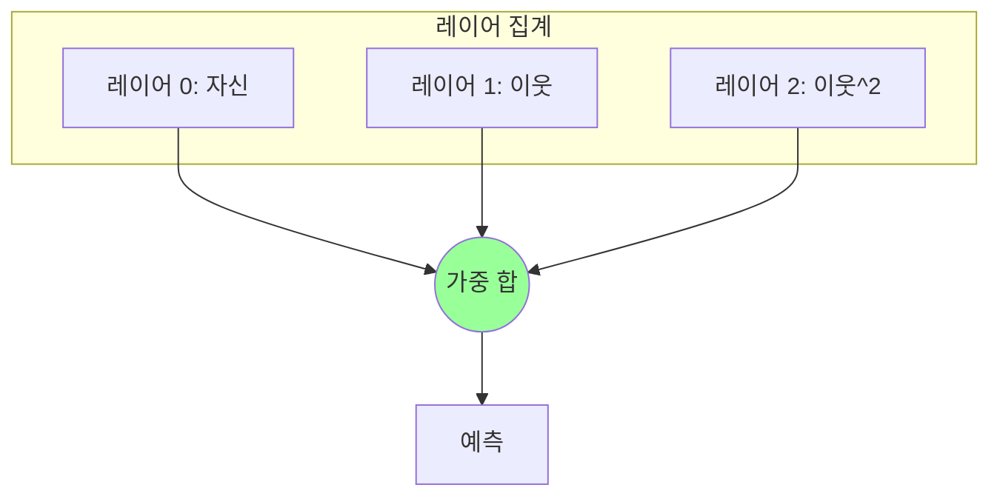

[< 상위 폴더로 이동](README.md)

<strong>전체 탐색 (RecSys 가이드)</strong>

- [홈](../../README.md)
- [01. 전통적 모델](../../01_Traditional_Models/README.md)
    - [협업 필터링](../../01_Traditional_Models/01_Collaborative_Filtering/README.md)
        - [메모리 기반](../../01_Traditional_Models/01_Collaborative_Filtering/01_Memory_Based/README.md)
        - [모델 기반](../../01_Traditional_Models/01_Collaborative_Filtering/02_Model_Based/README.md)
    - [콘텐츠 기반 필터링](../../01_Traditional_Models/02_Content_Based_Filtering/README.md)
- [02. 과도기 및 통계적 모델](../../02_Machine_Learning_Era/README.md)
- [03. 딥러닝 기반 모델](../../03_Deep_Learning_Era/README.md)
    - [MLP 기반](../../03_Deep_Learning_Era/01_MLP_Based/README.md)
    - [순차/세션 기반](../../03_Deep_Learning_Era/02_Sequence_Session_Based/README.md)
    - [그래프 기반](../../03_Deep_Learning_Era/03_Graph_Based/README.md)
    - [오토인코더 기반](../../03_Deep_Learning_Era/04_AutoEncoder_Based/README.md)
- [04. 최신 및 생성형 모델](../../04_SOTA_GenAI/README.md)
    - [LLM 기반](../../04_SOTA_GenAI/01_LLM_Based/README.md)
    - [멀티모달 추천](../../04_SOTA_GenAI/02_Multimodal_RS.md)
    - [생성형 추천](../../04_SOTA_GenAI/03_Generative_RS.md)

# LightGCN

## 1. 상세 설명 (Detailed Description)

### 정의 (Definition)

**LightGCN** (SIGIR 2020)은 NGCF에서 비선형 활성화 함수와 특징 변환 행렬을 제거한 단순화된 버전입니다. 저자들은 분류 문제에서는 필수적인 이 두 구성 요소가, 협업 필터링에서는 오히려 성능에 **방해**가 된다는 것을 증명했습니다.

### 왜 "Light"인가?

- 제거됨: $W_1, W_2$ 행렬 (학습 파라미터).
- 제거됨: $\sigma$ (ReLU/LeakyReLU).
- 유지됨: 오직 **그래프 컨볼루션** (이웃 집계)만 남김.
- 결과: 학습 속도가 빨라지고, 튜닝할 파라미터가 줄어들었으며, 성능은 획기적으로 향상되었습니다. 현재 그래프 기반 CF의 SOTA입니다.

### 주요 특징 (Key Characteristics)

- **선형 전파 (Linear Propagation)**: 학습 가능한 파라미터는 오직 초기 임베딩 $e_u^{(0)}$와 $e_i^{(0)}$ 뿐입니다.
- **장점**:
  - 매우 효율적입니다.
  - 구현이 쉽습니다.
  - 지속적으로 NGCF보다 성능이 좋습니다.
- **단점**:
  - 다른 그래프 모델과 마찬가지로, 초대형 그래프에서는 추론 시 메모리를 많이 소모할 수 있습니다.

---

## 2. 작동 원리 (Operating Principle)

### A. 단순화된 전파 규칙 (Simplified Propagation Rule)

가중치나 활성화 함수가 없으므로:
$$ e*u^{(k+1)} = \sum*{i \in N_u} \frac{1}{\sqrt{|N_u||N_i|}} e_i^{(k)} $$

- "사용자의 $k+1$ 레이어 벡터는 $k$ 레이어에서 그가 좋아한 아이템들의 가중 평균이다"라는 뜻입니다.
- 정규화 항 $\frac{1}{\sqrt{|N_u||N_i|}}$은 연결이 많은 노드(인기 아이템 등)의 값이 폭발하는 것을 방지합니다.

### B. 레이어 결합 (Layer Combination)

NGCF가 연결(Concatenation)을 사용하는 것과 달리, LightGCN은 모든 레이어의 임베딩을 가중 합산하여 최종 표현을 만듭니다.
$$ e*u = \sum*{k=0}^K \alpha_k e_u^{(k)} $$

- 보통 $\alpha_k$는 균일하게 설정합니다 ($1/(K+1)$).
- 왜 합치는가? 레이어 0은 본인, 레이어 1은 아이템, 레이어 2는 "성향이 비슷한 유저"를 나타냅니다. 이 모든 신호를 섞어서 사용하고자 함입니다.

### C. 예측 (Prediction)

$$ \hat{y}\_{ui} = e_u^T e_i $$

---

## 3. 흐름 예시 (Flow Example)

### 시나리오

User A는 Item 1과 연결됨. Item 1은 User B와 연결됨.
초기 임베딩: A=[1,0], 1=[0,1], B=[-1,0]. (정규화 무시)

### 과정 (간소화)

1.  **레이어 0**:

    - $A^{(0)} = [1, 0]$
    - $1^{(0)} = [0, 1]$

2.  **레이어 1 (1-hop 집계)**:

    - User A는 Item 1을 끌어옴.
    - $A^{(1)} \approx 1^{(0)} = [0, 1]$. (A는 아이템을 닮아감)
    - Item 1은 A와 B를 끌어옴.
    - $1^{(1)} \approx A^{(0)} + B^{(0)} = [1, 0] + [-1, 0] = [0, 0]$.

3.  **레이어 2 (2-hop 집계)**:

    - User A는 Item 1의 레이어 1 벡터를 끌어옴.
    - $A^{(2)} \approx 1^{(1)} = [0, 0]$. (신호 평활화).

4.  **최종 벡터 A**:
    - $A_{final} = \alpha_0 A^{(0)} + \alpha_1 A^{(1)} + ...$
    - $A_{final} = \frac{1}{2}([1,0] + [0,1]) = [0.5, 0.5]$.

### 시각적 다이어그램

