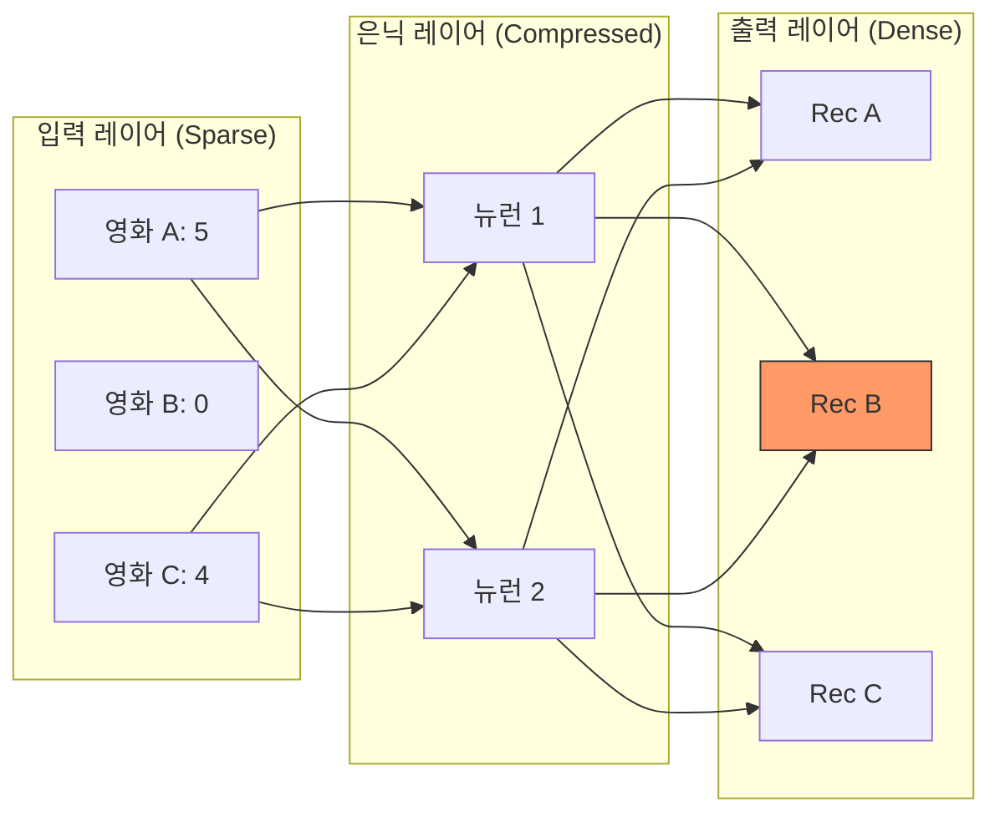

[< 상위 폴더로 이동](README.md)

<strong>전체 탐색 (RecSys 가이드)</strong>

- [홈](../../README.md)
- [01. 전통적 모델](../../01_Traditional_Models/README.md)
    - [협업 필터링](../../01_Traditional_Models/01_Collaborative_Filtering/README.md)
        - [메모리 기반](../../01_Traditional_Models/01_Collaborative_Filtering/01_Memory_Based/README.md)
        - [모델 기반](../../01_Traditional_Models/01_Collaborative_Filtering/02_Model_Based/README.md)
    - [콘텐츠 기반 필터링](../../01_Traditional_Models/02_Content_Based_Filtering/README.md)
- [02. 과도기 및 통계적 모델](../../02_Machine_Learning_Era/README.md)
- [03. 딥러닝 기반 모델](../../03_Deep_Learning_Era/README.md)
    - [MLP 기반](../../03_Deep_Learning_Era/01_MLP_Based/README.md)
    - [순차/세션 기반](../../03_Deep_Learning_Era/02_Sequence_Session_Based/README.md)
    - [그래프 기반](../../03_Deep_Learning_Era/03_Graph_Based/README.md)
    - [오토인코더 기반](../../03_Deep_Learning_Era/04_AutoEncoder_Based/README.md)
- [04. 최신 및 생성형 모델](../../04_SOTA_GenAI/README.md)
    - [LLM 기반](../../04_SOTA_GenAI/01_LLM_Based/README.md)
    - [멀티모달 추천](../../04_SOTA_GenAI/02_Multimodal_RS.md)
    - [생성형 추천](../../04_SOTA_GenAI/03_Generative_RS.md)

# 오토인코더 & CDAE (AutoRec & CDAE)

## 1. 상세 설명 (Detailed Description)

### 정의 (Definition)

**오토인코더(AutoEncoders)**는 입력을 병목 구간(Bottleneck)을 통과시켜 출력으로 복사하는 신경망입니다.

- **AutoRec** (2015): 이를 사용자의 평점 벡터에 적용했습니다. 희소 벡터 $r^{(u)}$를 입력받아, 잠재 코드로 압축한 뒤, 다시 완전한 밀집 벡터 $\hat{r}^{(u)}$로 복원합니다.
- **CDAE (Collaborative Denoising AutoEncoder)** (2016): 암시적 피드백(Implicit Feedback)을 위해 설계되었습니다. 입력에 임의로 0을 넣는 "Denoising" 기법을 사용하여 모델이 더 강건한 특징을 학습하게 하고, 사용자별 노드를 추가하여 편향을 포착합니다.

### 주요 특징 (Key Characteristics)

- **복원 (Reconstruction)**: 핵심 아이디어는 "빈 칸 채우기"입니다.
- **비선형성 (Non-linearity)**: PCA/SVD와 달리 활성화 함수(Sigmoid, ReLU)를 사용하여 비선형 패턴을 포착합니다.
- **장점**:
  - 희소한 데이터를 잘 다룹니다.
  - CDAE는 "무엇을 추천할까(Ranking)" 문제(Top-N)에 매우 강력합니다.
- **단점**:
  - AutoRec은 본질적으로 1개의 은닉층을 가진 NCF와 비슷하여, 최신 시퀀스 모델만큼 강력하지는 않습니다.

---

## 2. 작동 원리 (Operating Principle)

### AutoRec 아키텍처

1.  **입력**: 사용자 평점 벡터 $r^{(u)} \in \mathbb{R}^N$ (아이템 수). 대부분이 0(모름)입니다.
2.  **인코더 (Encoder)**:
    $$ h = f(V r^{(u)} + \mu) $$
    - 거대한 아이템 공간을 작은 잠재 공간으로 매핑합니다.
3.  **디코더 (Decoder)**:
    $$ \hat{r}^{(u)} = g(W h + b) $$
    - 전체 아이템 공간으로 다시 복원합니다.
4.  **학습**: 오직 **관찰된(Observed)** 평점에 대해서만 오차를 역전파합니다.
    $$ \min \sum*{u} \sum*{i \in I*u} || r*{ui} - \hat{r}\_{ui} ||^2 + \lambda ... $$

### CDAE 개선점

- **Denoising**: 입력의 일부 1을 0으로 지웁니다. "Q: 내가 스타워즈 본 사실을 숨겨도, 넌 내가 스타워즈를 좋아한다는 걸 맞출 수 있니?"
- **User Node**: 은닉층 입력에 고유한 학습 가능 가중치 벡터 $v_u$를 추가합니다.
  $$ h = \sigma(W \cdot \text{corrupt}(r_u) + V_u + b) $$
    이 $V_u$는 MF에서의 사용자 편향/벡터와 유사한 역할을 합니다.

---

## 3. 흐름 예시 (Flow Example)

### 시나리오

사용자가 **영화 A** (5점)와 **영화 C** (4점)를 평가했습니다. **영화 B**는 모릅니다 (0).

### 처리 과정

1.  **입력 벡터**: `[5, 0, 4]` (정규화 가정: `[1.0, 0, 0.8]`).
2.  **인코더**:
    - 가중치들이 1.0(A)과 0.8(C)와 곱해집니다.
    - 은닉 코드(Latent Code): `[0.9, 0.1]` (압축된 취향 프로필).
3.  **디코더**:
    - `[0.9, 0.1]`을 다시 3차원으로 확장합니다.
    - 출력: `[0.98, 0.7, 0.82]`.
4.  **예측**:
    - 영화 A: 0.98 $\approx$ 1.0 (복원 잘 함).
    - 영화 C: 0.82 $\approx$ 0.8 (복원 잘 함).
    - **영화 B**: **0.7**. (모델이 빈 칸을 0.7로 채움!).
    - 영화 B를 추천합니다 (높은 점수).

### 시각적 다이어그램

