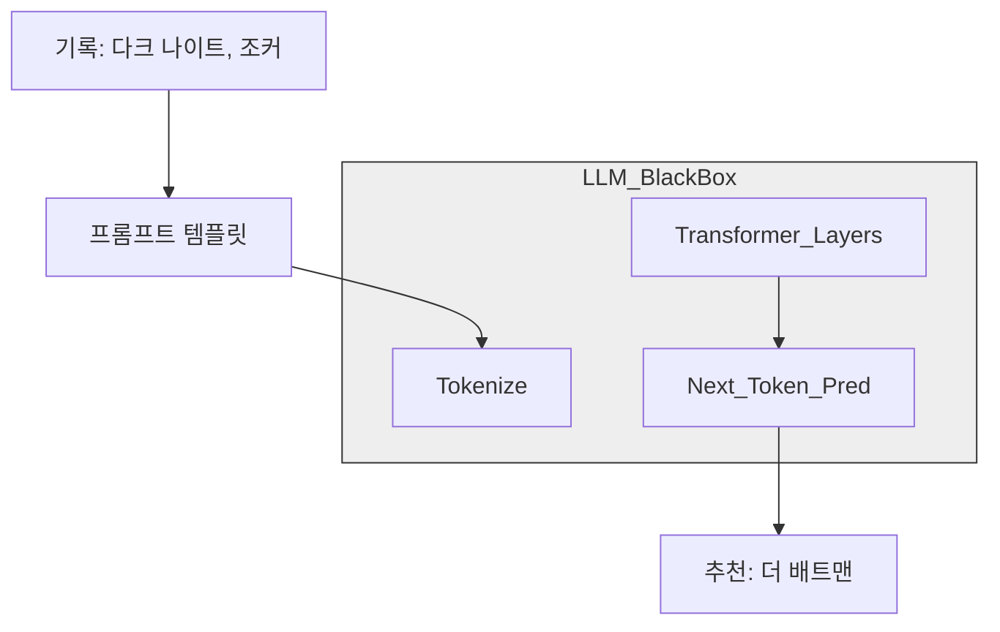

[< 상위 폴더로 이동](README.md)

<details>
<summary><strong>전체 탐색 (RecSys 가이드)</strong></summary>

- [홈](../../README.md)
- [01. 전통적 모델](../../01_Traditional_Models/README.md)
    - [협업 필터링](../../01_Traditional_Models/01_Collaborative_Filtering/README.md)
        - [메모리 기반](../../01_Traditional_Models/01_Collaborative_Filtering/01_Memory_Based/README.md)
        - [모델 기반](../../01_Traditional_Models/01_Collaborative_Filtering/02_Model_Based/README.md)
    - [콘텐츠 기반 필터링](../../01_Traditional_Models/02_Content_Based_Filtering/README.md)
- [02. 과도기 및 통계적 모델](../../02_Machine_Learning_Era/README.md)
- [03. 딥러닝 기반 모델](../../03_Deep_Learning_Era/README.md)
    - [MLP 기반](../../03_Deep_Learning_Era/01_MLP_Based/README.md)
    - [순차/세션 기반](../../03_Deep_Learning_Era/02_Sequence_Session_Based/README.md)
    - [그래프 기반](../../03_Deep_Learning_Era/03_Graph_Based/README.md)
    - [오토인코더 기반](../../03_Deep_Learning_Era/04_AutoEncoder_Based/README.md)
- [04. 최신 및 생성형 모델](../../04_SOTA_GenAI/README.md)
    - [LLM 기반](../../04_SOTA_GenAI/01_LLM_Based/README.md)
    - [멀티모달 추천](../../04_SOTA_GenAI/02_Multimodal_RS.md)
    - [생성형 추천](../../04_SOTA_GenAI/03_Generative_RS.md)
</details>

# LLM4Rec

## 1. 상세 설명 (Detailed Description)

### 정의 (Definition)

**LLM4Rec**은 거대 언어 모델(GPT-4, LLaMA, PaLM 등)을 추천 작업에 활용하는 모든 접근 방식을 통칭합니다. ID와 상호작용 행렬에만 의존하던 기존 모델과 달리, LLM은 인터넷의 방대한 의미론적 지식(World Knowledge)을 이미 학습하고 있어 이를 추천에 활용합니다.

### 패러다임 (Paradigms)

1.  **추천기로서의 LLM (Direct)**: "사용자 기록이 A, B, C일 때, 다음에 무엇을 사야 할까?"라고 질문하면 LLM이 직접 답변.
2.  **특징 인코더로서의 LLM (Feature Encoder)**: "이 영화 줄거리를 벡터로 변환해줘" -> 변환된 임베딩을 기존 딥러닝 모델에 주입.
3.  **데이터 생성기로서의 LLM (Augmentation)**: "가상의 사용자를 시뮬레이션해서 콜드 스타트 문제를 해결할 데이터를 만들어줘."

### 주요 특징 (Key Characteristics)

- **제로샷/퓨샷 (Zero-Shot / Few-Shot)**: 특정 데이터셋으로 파인튜닝하지 않아도 어느 정도 추천을 잘 수행합니다.
- **추론 능력 (Reasoning)**: 왜 이 아이템을 추천했는지("네가 디스토피아 SF를 좋아하니까...") 설명할 수 있습니다.
- **장점**:
  - 압도적인 **콜드 스타트** 성능.
  - 자연어 인터페이스(Chat-Rec) 가능.
- **단점**:
  - **환각 (Hallucination)**: 존재하지 않는 영화를 추천할 수 있음.
  - **지연 시간 (Latency)**: 텍스트 생성은 내적(Dot Product) 연산보다 훨씬 느립니다.
  - **위치 편향 (Position Bias)**: 프롬프트의 앞쪽이나 뒤쪽에 있는 아이템을 더 선호하는 경향이 있습니다.

---

## 2. 작동 원리 (Operating Principle)

### A. 프롬프트 엔지니어링 (Prompt Engineering)

핵심 알고리즘은 '질문을 잘 만드는 것'입니다.

- **지시 (Instruction)**: "너는 영화 전문가야..."
- **맥락 (Context)**: "사용자 기록: [매트릭스, 인셉션, 테넷]"
- **후보군 (Candidate Set)**: "후보: [바비, 오펜하이머, 인터스텔라]" (선택적 - 랭킹 모드 시)
- **작업 (Task)**: "후보들의 순위를 매겨줘."

### B. 인컨텍스트 러닝 (In-Context Learning, ICL)

프롬프트 안에 예시를 제공하여 모델이 원하는 포맷과 논리를 따르도록 유도합니다.

- Prompt: "사용자 A는 X,Y를 좋아함 -> 추천 Z. 사용자 B는 P,Q를 좋아함 -> 추천 R. 자 이제 사용자 C는..."

### C. 파인튜닝 (Instruction Tuning)

LLaMA 같은 모델을 가져와서 수천 개의 추천 작업(평점 예측, 설명 생성) 데이터로 추가 학습시킵니다. 단순히 텍스트를 완성하는 것이 아니라 추천 로직을 따르도록 정렬(Align)합니다.

---

## 3. 흐름 예시 (Flow Example)

### 시나리오: API를 통한 직접 추천

**사용자 기록**: "다크 나이트", "조커".

### 1단계: 프롬프트 구성

```text
System: 영화 추천 전문가로서 행동해.
User: 나는 "다크 나이트" (5/5)와 "조커" (4/5)를 봤어.
나는 심리적 깊이가 있는 어두운 히어로물을 좋아해.
안 본 영화 1개를 추천해줘.
```

### 2단계: LLM 추론 (내부)

1.  **기록 분석**: 다크 나이트 & 조커 -> DC 유니버스, 고담, 거칠고(Gritty), 심리 스릴러.
2.  **지식 검색**: 뭐가 비슷하지? "더 배트맨 (2022)", "왓치맨", "브이 포 벤데타".
3.  **필터링**: "더 배트맨"이 가장 최신이고 스타일이 비슷함.

### 3단계: 생성 (Generation)

```text
Response: "더 배트맨 (2022)"을 추천합니다.
이유: 당신이 좋아한 이전 영화들과 마찬가지로, 고담 시티에 대한 누아르 탐정물적 해석을 보여주며, '조커'가 아서 플렉을 탐구했듯이 브루스 웨인의 심리를 깊이 있게 다룹니다.
```

### 시각적 다이어그램

