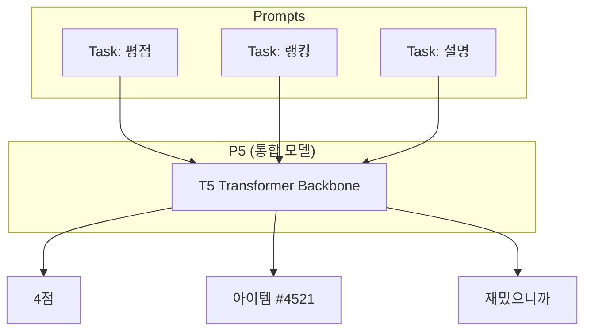

[< 상위 폴더로 이동](README.md)

<strong>전체 탐색 (RecSys 가이드)</strong>

- [홈](../../README.md)
- [01. 전통적 모델](../../01_Traditional_Models/README.md)
    - [협업 필터링](../../01_Traditional_Models/01_Collaborative_Filtering/README.md)
        - [메모리 기반](../../01_Traditional_Models/01_Collaborative_Filtering/01_Memory_Based/README.md)
        - [모델 기반](../../01_Traditional_Models/01_Collaborative_Filtering/02_Model_Based/README.md)
    - [콘텐츠 기반 필터링](../../01_Traditional_Models/02_Content_Based_Filtering/README.md)
- [02. 과도기 및 통계적 모델](../../02_Machine_Learning_Era/README.md)
- [03. 딥러닝 기반 모델](../../03_Deep_Learning_Era/README.md)
    - [MLP 기반](../../03_Deep_Learning_Era/01_MLP_Based/README.md)
    - [순차/세션 기반](../../03_Deep_Learning_Era/02_Sequence_Session_Based/README.md)
    - [그래프 기반](../../03_Deep_Learning_Era/03_Graph_Based/README.md)
    - [오토인코더 기반](../../03_Deep_Learning_Era/04_AutoEncoder_Based/README.md)
- [04. 최신 및 생성형 모델](../../04_SOTA_GenAI/README.md)
    - [LLM 기반](../../04_SOTA_GenAI/01_LLM_Based/README.md)
    - [멀티모달 추천](../../04_SOTA_GenAI/02_Multimodal_RS.md)
    - [생성형 추천](../../04_SOTA_GenAI/03_Generative_RS.md)

# P5 (Pretrain, Personalized, Prompt, Predict, Recommendation)

## 1. 상세 설명 (Detailed Description)

### 정의 (Definition)

**P5** (Generic Foundation Model for Recommendation)는 추천 시스템의 다양한 작업들을 단 하나의 Sequence-to-Sequence (Seq2Seq) 모델(구체적으로는 T5 Transformer)로 통합한 프레임워크입니다. 평점 예측(회귀)이나 Top-N 추천(랭킹)을 위해 별도의 모델을 두는 대신, P5는 **모든 작업(Task)을 자연어 프롬프트로 변환**하여 해결합니다.

### 해결하고자 하는 문제 (The Problem it Solves)

- **파편화 (Fragmentation)**: 전통적인 추천 시스템은 각 작업마다 다른 아키텍처가 필요했습니다 (예: 설명 생성에는 별도의 NLG 모델 필요).
- **전이 (Transfer)**: 평점 예측 작업에서 배운 지식을 설명 생성 작업으로 전이하기 어려웠습니다.
- **P5의 해결책**: 모든 것을 텍스트 생성 문제로 취급합니다.

### 주요 특징 (Key Characteristics)

- **개인화된 프롬프트 (Personalized Prompt)**: 프롬프트 안에 사용자 ID와 아이템 ID를 (토큰 형태로) 포함하여 생성을 개인화합니다.
- **파운데이션 모델 (Foundational)**: "추천 시스템을 위한 GPT"로 가는 단계입니다.
- **장점**:
  - 통합된 아키텍처.
  - 새로운 작업에 대한 제로샷/퓨샷 능력이 뛰어납니다.
- **단점**:
  - 토큰 ID 충돌 (사용자 "123"과 숫자 "123"을 혼동할 수 있음).
  - 확장성: 아이템 ID를 토큰 단위로 하나씩 생성하는 것은 검색(Retrieval)보다 느립니다.

---

## 2. 작동 원리 (Operating Principle)

### 5가지 프롬프트 템플릿 (5 Families of Prompt Templates)

P5는 5가지 핵심 작업을 위한 템플릿을 정의합니다:

1.  **직접 추천 (Direct Recommendation)**: "사용자 A를 위한 다음 아이템을 예측해."
2.  **평점 예측 (Rating Prediction)**: "사용자 A는 아이템 B에 몇 점을 줄까?"
3.  **설명 생성 (Explanation Generation)**: "사용자 A가 아이템 B를 좋아하는 이유를 설명해."
4.  **리뷰 요약 (Review Summarization)**: "사용자 A가 아이템 B에 대해 쓴 리뷰를 요약해."
5.  **순차 예측 (Sequential Prediction)**: "기록 [...]이 주어졌을 때, 다음은 무엇인가?"

### 학습 (Training)

- **기반 모델**: T5 (Text-to-Text Transfer Transformer).
- **프롬프트 튜닝**: (프롬프트, 레이블) 쌍으로 구성된 대규모 데이터셋으로 모델을 파인튜닝합니다.
- **입력**: `User_101 watched Movie_55. Will he like it?`
- **타겟**: `yes`
- **입력**: `Why did User_101 like Movie_55?`
- **타겟**: `Because it is a comedy.`

---

## 3. 흐름 예시 (Flow Example)

### 시나리오

사용자 77이 추천과 설명을 원합니다.

### 작업 1: 추천 (Recommendation)

1.  **프롬프트**: "저는 User_77입니다. Movie_1, Movie_2를 봤습니다. 다음에 무엇을 봐야 할까요?"
2.  **모델 생성**: "Movie_99" (모델은 User_77의 시퀀스가 Movie_99로어진다는 패턴을 학습함).

### 작업 2: 설명 (Explanation)

1.  **프롬프트**: "User_77에게 Movie_99를 추천하는 정당한 이유를 써주세요."
2.  **모델 생성**: "User_77이 이전 영화들에서 액션 시퀀스를 즐겼기 때문에, Movie_99도 비슷한 스릴을 제공할 것입니다."

### 시각적 다이어그램

