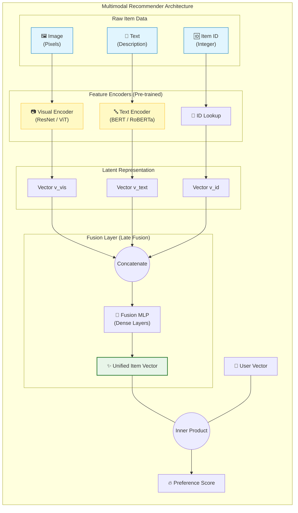

[< 상위 폴더로 이동](README.md)

<strong>전체 탐색 (RecSys 가이드)</strong>

- [홈](../README.md)
- [01. 전통적 모델](../01_Traditional_Models/README.md)
  - [협업 필터링](../01_Traditional_Models/01_Collaborative_Filtering/README.md)
    - [메모리 기반](../01_Traditional_Models/01_Collaborative_Filtering/01_Memory_Based/README.md)
    - [모델 기반](../01_Traditional_Models/01_Collaborative_Filtering/02_Model_Based/README.md)
  - [콘텐츠 기반 필터링](../01_Traditional_Models/02_Content_Based_Filtering/README.md)
- [02. 과도기 및 통계적 모델](../02_Machine_Learning_Era/README.md)
- [03. 딥러닝 기반 모델](../03_Deep_Learning_Era/README.md)
  - [MLP 기반](../03_Deep_Learning_Era/01_MLP_Based/README.md)
  - [순차/세션 기반](../03_Deep_Learning_Era/02_Sequence_Session_Based/README.md)
  - [그래프 기반](../03_Deep_Learning_Era/03_Graph_Based/README.md)
  - [오토인코더 기반](../03_Deep_Learning_Era/04_AutoEncoder_Based/README.md)
- [04. 최신 및 생성형 모델](../04_SOTA_GenAI/README.md) - [LLM 기반](../04_SOTA_GenAI/01_LLM_Based/README.md) - [멀티모달 추천](../04_SOTA_GenAI/02_Multimodal_RS.md) - [생성형 추천](../04_SOTA_GenAI/03_Generative_RS.md)

# 멀티모달 추천 (Multimodal RS)

## 1. 상세 설명 (Detailed Description)

### 정의 (Definition)

**멀티모달 추천 시스템**은 표준적인 사용자-아이템 상호작용 행렬뿐만 아니라 보조적인 데이터 모달리티(이미지, 오디오, 비디오, 텍스트)를 활용합니다. 특히 시각적이나 청각적으로 풍부한 도메인에서, 아이템의 콘텐츠가 아이템의 ID만큼 중요하다는 점에 착안합니다.

### 해결하고자 하는 문제 (The Problem it Solves)

- **콜드 스타트**: 새로운 드레스는 평점이 없습니다 (ID가 쓸모 없음). 하지만 이미지는 가지고 있습니다 (시각적 모달리티는 풍부함). 모델은 "시각적으로 유사한" 드레스를 좋아하는 사용자에게 이를 추천할 수 있습니다.
- **세밀한 선호도 (Fine-grained Preference)**: 사용자는 영화를 장르(텍스트) 때문이 아니라 영상미(시각) 때문에 좋아할 수도 있습니다.

### 주요 특징 (Key Characteristics)

- **인코더 (Encoders)**: 심층 인코더들로 구동됩니다 (이미지는 ResNet/ViT, 텍스트는 BERT, 오디오는 VGGish).
- **융합 (Fusion)**: ID 임베딩과 콘텐츠 임베딩을 결합하는 예술입니다.
- **장점**:
  - 새로운 아이템에 대한 성능을 획기적으로 개선합니다.
  - 패션, 예술, 음악, 틱톡 같은 숏폼 비디오 앱에 필수적입니다.
- **단점**:
  - 계산 비용이 높습니다 (이미지/비디오 처리).
  - 저장 공간을 많이 차지합니다 (특징 벡터 저장).

---

## 2. 작동 원리 (Operating Principle)

### 아키텍처

1.  **특징 추출 (Feature Extraction - Offline/Online)**:

    - **Visual**: 아이템 이미지 $I_i$를 사전 학습된 CNN(예: ResNet50)에 통과시켜 벡터 $v_i$를 얻습니다.
    - **Textual**: 설명 $T_i$를 BERT에 통과시켜 벡터 $t_i$를 얻습니다.
    - **ID**: ID 임베딩 $e_{id}$를 조회합니다.

2.  **융합 전략 (Fusion Strategies)**:

    - **결합 (Concatenation - Early Fusion)**:
      $$ e*{final} = \text{MLP}([e*{id}, v_i, t_i]) $$
    - **어텐션 기반 융합 (Attention-based Fusion)**: 모델이 _이_ 아이템에 대해 어떤 모달리티가 중요한지 결정하게 합니다.
      $$ e*{final} = \alpha_1 e*{id} + \alpha_2 v_i + \alpha_3 t_i $$
    - **그래프 융합 (MMGCN)**: 각 모달리티가 고유한 그래프를 가지고, GNN을 통해 학습한 뒤 집계합니다.

3.  **예측 (Prediction)**:
    - 사용자 벡터와 아이템 최종 벡터 간의 표준 내적 또는 MLP.

---

## 3. 흐름 예시 (Flow Example)

### 시나리오: 패션 앱 (붉은 꽃무늬 드레스를 좋아하는 사용자)

**후보**: "신상 여름 드레스" (아직 평점 없음).
**데이터**: 이미지 (빨강, 꽃무늬), 텍스트 ("시원한 여름 의상").

### 처리 과정

1.  **Visual 인코더**:
    - 입력: 이미지.
    - 출력: 벡터 $v_{img}$ ('빨강', '패턴'에 대한 강한 신호).
2.  **사용자 표현**:
    - 사용자 기록에는 비슷한 $v_{img}$를 가진 아이템이 많음.
    - 모델은 사용자 벡터 $P_u$가 '빨강/패턴' 시각적 공간과 가깝다는 것을 학습함.
3.  **매칭**:
    - ID 임베딩은 랜덤하더라도 (콜드 스타트), $P_u \cdot v_{img}$ 값은 높음.
    - **예측**: 높은 확률로 추천.

### 시각적 다이어그램

