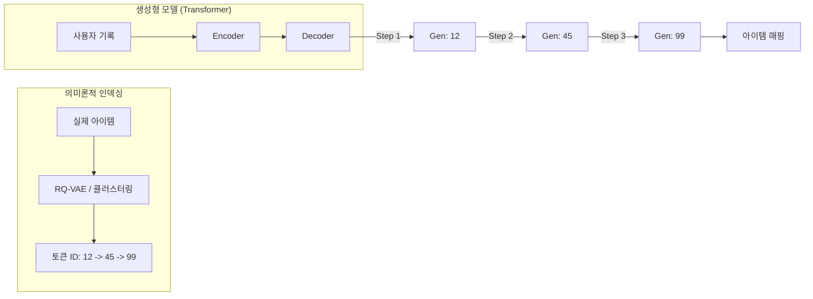

[< 상위 폴더로 이동](README.md)

<strong>전체 탐색 (RecSys 가이드)</strong>

- [홈](../README.md)
- [01. 전통적 모델](../01_Traditional_Models/README.md)
    - [협업 필터링](../01_Traditional_Models/01_Collaborative_Filtering/README.md)
        - [메모리 기반](../01_Traditional_Models/01_Collaborative_Filtering/01_Memory_Based/README.md)
        - [모델 기반](../01_Traditional_Models/01_Collaborative_Filtering/02_Model_Based/README.md)
    - [콘텐츠 기반 필터링](../01_Traditional_Models/02_Content_Based_Filtering/README.md)
- [02. 과도기 및 통계적 모델](../02_Machine_Learning_Era/README.md)
- [03. 딥러닝 기반 모델](../03_Deep_Learning_Era/README.md)
    - [MLP 기반](../03_Deep_Learning_Era/01_MLP_Based/README.md)
    - [순차/세션 기반](../03_Deep_Learning_Era/02_Sequence_Session_Based/README.md)
    - [그래프 기반](../03_Deep_Learning_Era/03_Graph_Based/README.md)
    - [오토인코더 기반](../03_Deep_Learning_Era/04_AutoEncoder_Based/README.md)
- [04. 최신 및 생성형 모델](../04_SOTA_GenAI/README.md)
    - [LLM 기반](../04_SOTA_GenAI/01_LLM_Based/README.md)
    - [멀티모달 추천](../04_SOTA_GenAI/02_Multimodal_RS.md)
    - [생성형 추천](../04_SOTA_GenAI/03_Generative_RS.md)

# 생성형 추천 (Generative RS)

## 1. 상세 설명 (Detailed Description)

### 정의 (Definition)

**생성형 추천 시스템(GenRec)**은 추천의 패러다임을 "랭킹(Ranking)"에서 "**생성(Generation)**"으로 전환하는 접근법입니다. 고정된 아이템 풀에서 최적의 아이템을 선택(검색/분류)하는 전통적인 방식과 달리, 생성형 모델은 문맥을 바탕으로 타겟 아이템의 **식별자(ID)나 내용을 직접 생성**합니다.

### 해결하고자 하는 문제 (The Problem it Solves)

- **대규모 소프트맥스 (Massive Softmax)**: 기존 딥러닝에서 1억 개의 아이템에 대해 소프트맥스를 계산하는 것은 불가능에 가깝습니다. 보통 ANN(Approximate Nearest Neighbors)을 사용해야 했습니다.
- **생성적 검색 (Generative Retrieval)**: 이 방식은 무거운 인덱스(FAISS, HNSW)를 제거합니다. "인덱스"가 모델 가중치 안에 암묵적으로 저장됩니다. "다음은?"이라고 물으면 모델이 "Item_ID_123"이라고 타이핑해줍니다.

### 주요 특징 (Key Characteristics)

- **검색은 곧 생성 (Retrieval is Generation)**: 모델은 (사용자 맥락 $\to$ 아이템 토큰 시퀀스) 매핑을 학습합니다.
- **의미론적 ID (Semantic IDs)**: 무의미한 정수 ID 대신, 계층적이고 의미 있는 코드로 변환하기 위해 영리한 인덱싱 기법(예: RQ-VAE)이 필요합니다.
- **장점**:
  - 단순화된 통합 아키텍처 (그저 트랜스포머 하나).
  - 잠재적으로 더 빠른 추론 (외부 ANN 검색 불필요).
- **단점**:
  - **환각 (Hallucination)**: 존재하지 않는 ID를 생성할 수 있음.
  - **신규 아이템**: 토크나이저를 재학습하지 않고는 추가하기 어려움.

---

## 2. 작동 원리 (Operating Principle)

### A. 의미론적 ID 생성 (Semantic ID Creation / Indexing)

학습 전에 아이템을 "생성 가능한(Generate-able)" 토큰으로 변환해야 합니다.

1.  **클러스터 기반 (Cluster-based)**: 계층적 클러스터링.
    - Item A $\to$ Cluster 1 $\to$ Sub-cluster 5 $\to$ Item A.
    - ID: "1-5-A".
2.  **의미 기반 (Semantic-based)**: 아이템 제목 활용.
    - Item "아이언맨" $\to$ 토큰 ["아이언", "맨"].

### B. 학습 (Training - Seq2Seq)

- **입력**: "User History: [Item A, Item B]"
- **타겟**: "Item C" (토큰 "3-2-C"로 표현됨).
- **손실함수**: 표준 언어 모델링 손실 (다음 토큰 예측에 대한 Cross Entropy).

### C. 추론 (Inference - Beam Search)

- 모델이 ID를 토큰 단위로 생성합니다.
- 빔 서치(Beam Search)를 통해 여러 개의 유력한 아이템 ID를 동시에 탐색합니다.
- **제약 조건**: 유효한 아이템 ID만 뱉도록 강제합니다 (Trie 기반 제약 디코딩).

---

## 3. 흐름 예시 (Flow Example)

### 시나리오: 계층적 인덱싱 (도서관 비유)

- 레벨 1: 장르 (소설, 비소설)
- 레벨 2: 작가 (롤링, 킹)
- 레벨 3: 책

**책 "해리포터"** ID: `소설` -> `롤링` -> `HP1`.

### 처리 과정

1.  **배경**: 사용자가 방금 "호빗"을 읽었음.
2.  **생성 1단계**:
    - 입력: "Context: 호빗".
    - 출력: `소설` (높은 확률).
3.  **생성 2단계**:
    - 입력: "Context: 호빗, 소설".
    - 출력: `롤링` (판타지 장르 연결성으로 인해 높은 확률).
4.  **생성 3단계**:
    - 입력: "Context: 호빗, 소설, 롤링".
    - 출력: `HP1` (해리포터 1권).
5.  **결과**: "해리포터 1권" 추천.

_사서가 생각하는 방식과 매우 유사합니다: "판타지 섹션... 롤링 쪽이겠네... 그래, 해리포터."_

### 시각적 다이어그램

